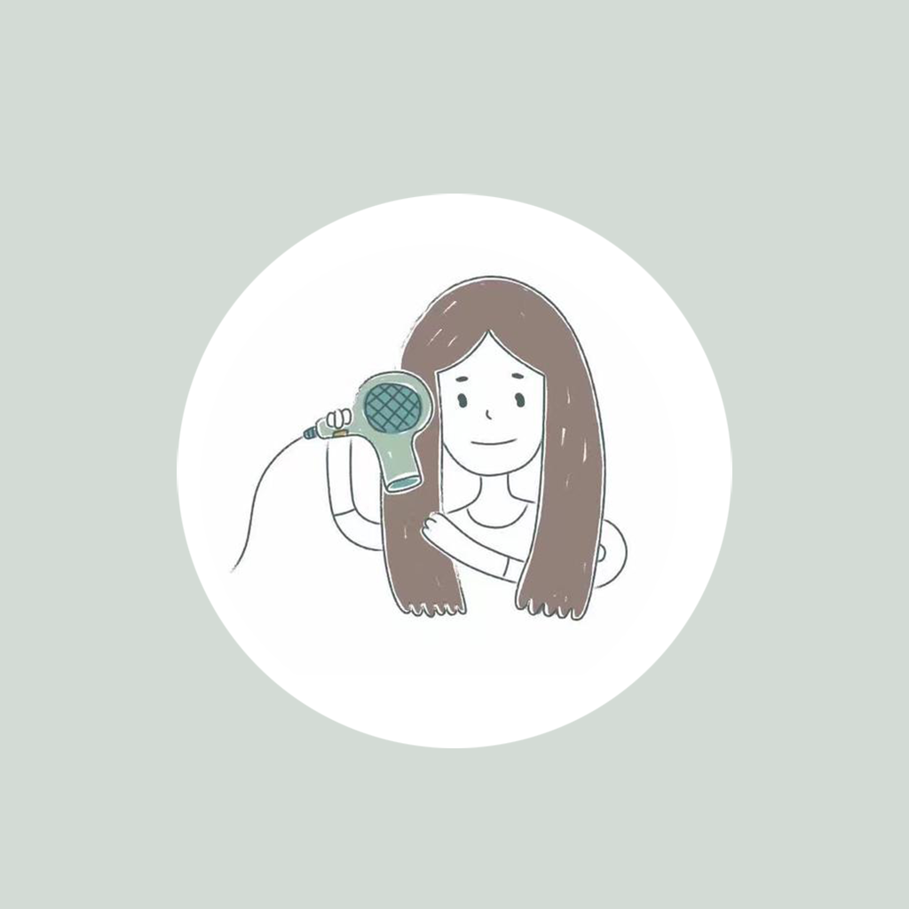

## Welcome to My Hair Blower Category Record

In our daily life, we often use hair dryer to help us shape various hairstyles. The functions and functions of each hair dryer are quite different. For example, when you need to blow curly hair today, you need a blower with a stronger wind and enough temperature. You can classify all kinds of hair dryers with different functions at home, record the functions of each hair dryer, rated voltage, requirements for hair quality and styling effect, etc. In this way, you can find the hair dryer you want very conveniently and quickly, which is convenient for your life.

If you have any questions, you can either leave a message or send the questions to our email address.

We will answer them for you in the first time.

### Address: BeatriceArlenexSgPdE@yahoo.com

Thank you!
